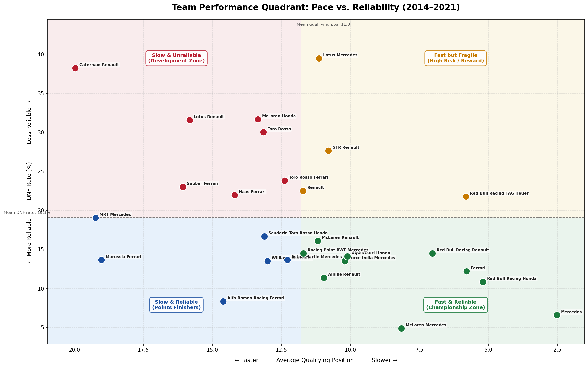

# F1 Qualifying Performance as a Race Outcome Predictor

A data mining analysis of Formula One race data (2006–2023) examining 
whether qualifying position is a reliable predictor of final race outcome.

## Overview

This project validates and extends the findings of Weissbock & Mills (2025) 
using three statistical methodologies and proposes a novel analytical framework.

**Key findings:**
- Spearman's ρ = 0.775 between qualifying position and race finish (p < 0.001, n = 6,005)
- Contingency Coefficient C = 0.773 across the full dataset
- OLR McFadden R² = 0.34 — qualifying alone explains ~34% of race outcome variance
- Qualifying is the strongest predictor across all 5 session variables, 
  outperforming practice sessions and race start position

## Novel Contribution

A **Team Reliability vs. Pace Quadrant Analysis** is proposed to address 
a key limitation of the original study: DNF events as a confounding variable. 
Teams are mapped across two independent dimensions — pace (avg qualifying 
position) and reliability (DNF rate) — revealing four strategic profiles.



## Methods

| Method | Purpose |
|--------|---------|
| Contingency Coefficient (C) | Nominal association between qualifying and race position |
| Spearman's Rank Correlation (ρ) | Monotonic rank-order relationship |
| Ordinal Logistic Regression (OLR) | Rigorous ordinal prediction model |
| Quadrant Analysis | Novel pace vs. reliability decomposition |

## Repository Structure
├── notebook/          # Main Jupyter notebook

├── data/              # Data source instructions

├── outputs/           # Saved visualisations

└── report/            # Full research paper (PDF)

## Setup

```bash
git clone https://github.com/YOUR_USERNAME/f1-qualifying-race-prediction.git
cd f1-qualifying-race-prediction
pip install -r requirements.txt
```

Then download the data files per `data/README.md` instructions, 
and run `notebook/QualifyingF1_Analysis.ipynb` from top to bottom.

## Dataset

Weissbock, J. (2024). *f1-data* [Data set]. GitHub.  
https://github.com/jweissbock/f1-data

## Reference

Weissbock, J., & Mills, S. (2025). Evaluating the predictive power of 
qualifying performance in Formula One Grand Prix [Preprint]. arXiv.  
https://arxiv.org/abs/2507.10966

## Author

**Fitri Aulia Hanifa**  
School of Computer Science, Taylor's University  
fitrihanifa611@gmail.com
